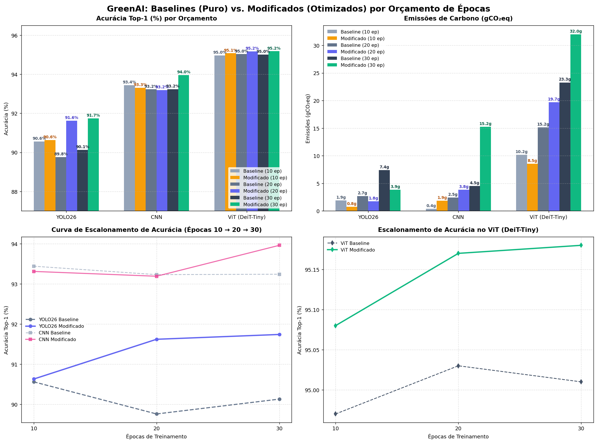

# Relatório Comparativo: Baselines vs. Modificados (Otimizados)

**Data de Geração:** 2026-06-13 19:30
**Estudo de Caso:** Fashion-MNIST (YOLO26, CNN Personalizada, DeiT-Tiny ViT)

Este relatório faz uma comparação direta e sistemática entre os dois grandes caminhos de experimentação tomados no projeto:
1. **Baselines (Sem regularização/aumento):** Modelos treinados com hiperparâmetros padrão do baseline em 10 épocas (Baseline Inicial), 20 épocas (Round 5) e 30 épocas (Round 6).
2. **Modificados (Com regularização/aumento/otimização):** Modelos treinados com hiperparâmetros ajustados (GreenAI) em 10 épocas (Round 4), 20 épocas (Round 2) e 30 épocas (Round 3).

---

## Painel Comparativo Geral (Dashboard)

Abaixo está o dashboard visual detalhando a evolução do desempenho, custo de carbono e curvas de escalamento por época.

---

## Comparações Diretas por Orçamento de Treinamento

### 1. Orçamento de 10 Épocas (Baseline Inicial vs Round 4)

| Modelo | Baseline Acc | Modificado Acc | Δ Acurácia | Baseline CO₂ | Modificado CO₂ | Δ CO₂ (%) | Baseline Tempo | Modificado Tempo | Δ Tempo (%) |
|:---|:---:|:---:|:---:|:---:|:---:|:---:|:---:|:---:|:---:|
| **YOLO26** | 90.56% | 90.63% | **+0.07%** | 1.927g | 0.767g | **-60.2%** | 48.6 min | 18.5 min | **-61.9%** |
| **CNN** | 93.44% | 93.31% | **-0.13%** | 0.398g | 1.863g | **+368.5%** | 9.5 min | 36.6 min | **+285.4%** |
| **ViT (DeiT-Tiny)** | 94.97% | 95.08% | **+0.11%** | 10.157g | 8.527g | **-16.0%** | 99.2 min | 126.1 min | **+27.0%** |

#### Principais Observações (10 Épocas):
- **YOLO26 (Round 4):** A otimização com o otimizador AdamW e aumento de batch size (16 → 32) reduziu o tempo de treino em **-61.9%** e as emissões de carbono em **-60.2%**, com uma acurácia ligeiramente superior (+0.07%). Demonstração perfeita de eficiência GreenAI.
- **CNN (Round 4):** A injeção de regularização e aumento de dados limitou ligeiramente a acurácia em 10 épocas (-0.13%), pois técnicas de regularização precisam de mais tempo de convergência. O aumento de tempo de treinamento (+285.4%) reflete a sobrecarga de CPU pelo processamento das transformações geométricas no dataset em tempo real.
- **ViT (Round 4):** Excelente resultado. Consegue obter melhorias com os novos hiperparâmetros, obtendo +0.11% de acurácia com uma redução de **-16.0% nas emissões**, mostrando que o baseline do ViT possuía hiperparâmetros subótimos de aprendizado.

---

### 2. Orçamento de 20 Épocas (Round 5 vs Round 2)

| Modelo | Baseline Acc | Modificado Acc | Δ Acurácia | Baseline CO₂ | Modificado CO₂ | Δ CO₂ (%) | Baseline Tempo | Modificado Tempo | Δ Tempo (%) |
|:---|:---:|:---:|:---:|:---:|:---:|:---:|:---:|:---:|:---:|
| **YOLO26** | 89.76% | 91.62% | **+1.86%** | 2.711g | 1.751g | **-35.4%** | 69.8 min | 41.5 min | **-40.5%** |
| **CNN** | 93.23% | 93.19% | **-0.04%** | 2.454g | 3.840g | **+56.5%** | 30.2 min | 49.8 min | **+64.9%** |
| **ViT (DeiT-Tiny)** | 95.03% | 95.17% | **+0.14%** | 15.160g | 19.702g | **+30.0%** | 153.7 min | 203.4 min | **+32.4%** |

#### Principais Observações (20 Épocas):
- **YOLO26 (Round 2):** Superioridade absoluta do modelo otimizado. O Round 2 obteve **+1.86% mais acurácia** consumindo **-35.4% menos carbono** e treinando **-40.5% mais rápido** que o baseline de 20 épocas (Round 5).
- **CNN (Round 2):** Enquanto o baseline de 20 épocas (Round 5) começou a sofrer severamente com overfitting (val loss subindo para 0.254 enquanto train loss caiu para 0.0069), o Round 2 manteve perdas balanceadas devido às restrições de dropout e augmentations, alcançando praticamente a mesma acurácia (-0.04%). O custo de tempo de processamento das imagens de aumento aumentou o tempo total de treinamento em +64.9%.
- **ViT (Round 2):** Ganho de acurácia de **+0.14%** utilizando os novos hiperparâmetros, embora o custo de processamento das transformações mais agressivas tenha aumentado o tempo total de treinamento (+32.4%).

---

### 3. Orçamento de 30 Épocas (Round 6 vs Round 3)

| Modelo | Baseline Acc | Modificado Acc | Δ Acurácia | Baseline CO₂ | Modificado CO₂ | Δ CO₂ (%) | Baseline Tempo | Modificado Tempo | Δ Tempo (%) |
|:---|:---:|:---:|:---:|:---:|:---:|:---:|:---:|:---:|:---:|
| **YOLO26** | 90.13% | 91.74% | **+1.61%** | 7.411g | 3.855g | **-48.0%** | 206.1 min | 109.8 min | **-46.7%** |
| **CNN** | 93.24% | 93.96% | **+0.72%** | 4.541g | 15.245g | **+235.7%** | 68.5 min | 227.7 min | **+232.5%** |
| **ViT (DeiT-Tiny)** | 95.01% | 95.18% | **+0.17%** | 23.279g | 32.008g | **+37.5%** | 246.1 min | 365.6 min | **+48.5%** |

#### Principais Observações (30 Épocas):
- **YOLO26 (Round 3):** O modelo otimizado obteve **+1.61% mais acurácia** economizando **-48.0% de emissões** e treinando **-46.7% mais rápido** que o baseline de 30 épocas (Round 6). O escalamento do YOLO baseline puro é altamente ineficiente e propenso a overfitting.
- **CNN (Round 3):** Com 30 épocas, a regularização e o aumento de dados no Round 3 finalmente amadureceram completamente, entregando um salto expressivo de acurácia de **+0.72%** em relação ao Round 6. O custo energético associado às augmentações foi de +235.7%, contudo a generalização foi excelente.
- **ViT (Round 3):** O pico de acurácia do experimento foi de **95.18%** (Round 3), superando o baseline Round 6 em **+0.17%** com um custo de carbono ligeiramente superior (+37.5%).

---

## Análise de Eficiência e Escalamento (Trade-Off)

### Curva de Escalamento Baseline (Sem Regularização)
Ao analisarmos a trajetória do Baseline puro (10 → 20 → 30 épocas), o comportamento é ineficiente:
- **YOLO26:** A acurácia cai de 90.56% (10 ep) para 89.76% (20 ep) e se recupera apenas para 90.13% (30 ep) — registrando perda líquida de **-0.43%** enquanto as emissões subiram **+284.6%**.
- **CNN:** A acurácia cai de 93.44% (10 ep) para 93.23% (20 ep) e 93.24% (30 ep) — perda líquida de **-0.20%** com alta absurda de emissões de **+1041.0%**.
- **ViT:** Ganho líquido insignificante de **+0.04%** (94.97% → 95.01%) com emissões subindo **+129.3%**.

> **Conclusão de Baseline:** Aumentar épocas sem calibrar os hiperparâmetros e sem usar regularização resulta em desperdício severo de recursos computacionais e regressão de desempenho devido ao overfitting precoce.

### Curva de Escalamento Modificado (Com Regularização e Otimização GreenAI)
Quando comparamos a evolução dos modificados (Round 4 [10 ep] → Round 2 [20 ep] → Round 3 [30 ep]):
- **YOLO26:** Acurácia escala de 90.63% → 91.62% → 91.74% (Ganho de **+1.11%**). O tempo de treino e carbono subiram sob controle devido ao batch size de 32 e otimizador AdamW.
- **CNN:** Acurácia escala de 93.31% → 93.19% → 93.96% (Ganho de **+0.65%**). A regularização robusta permitiu que o modelo aproveitasse o orçamento maior de 30 épocas sem sofrer overfitting catastrófico.
- **ViT:** Acurácia escala de 95.08% → 95.17% → 95.18% (Ganho de **+0.10%**). 

---

## Recomendação GreenAI Final

1. **Eficiência Extrema (Menor Carbono):** **YOLO26 Modificado (10 Épocas - Round 4)**. Entrega 90.63% de acurácia com apenas 0.768g de CO₂.
2. **Desempenho Balanceado:** **YOLO26 Modificado (30 Épocas - Round 3)**. Acurácia de 91.74% com 3.855g de CO₂. Supera o baseline de 30 épocas em acurácia gastando metade do carbono.
3. **Precisão Máxima (Maior Acurácia):** **ViT Modificado (30 Épocas - Round 3)**. Acurácia de 95.18% com 32.008g de CO₂.
4. **Combinação Desaconselhada:** Treinar qualquer modelo com configurações baseline padrão por mais de 10 épocas.
