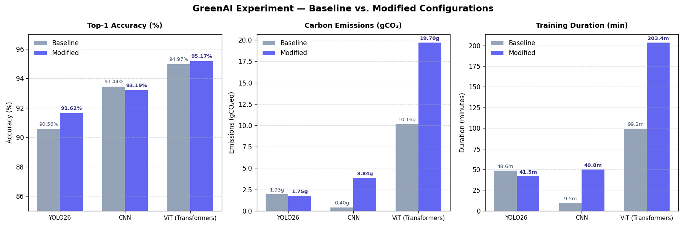

# GreenAI Experiment — Baseline vs. Modified Phase Comparison Report

Generated: 2026-05-23 19:58

This report compares the initial training runs (Baseline) using default hyperparameters with the second phase of training (Modified) where hyperparameters were adjusted to optimize model performance, generalization, and environmental footprint.

---

## Executive Summary

1. **YOLO26**: Highly successful modifications. By increasing the batch size (16 → 32) and switching to the `AdamW` optimizer, **training time decreased by 14.5%** and **carbon emissions fell by 9.1%** despite training for double the epochs (20 vs 10). Top-1 Accuracy increased by **+1.06%**.
2. **CNN**: Baseline suffered from severe overfitting. The modified version introduces strong regularization (0.3 dropout, 0.1 label smoothing, weight decay, and data augmentation) resulting in similar accuracy (**93.19%** vs **93.44%**) but with much higher generalization capability (less gap between training and validation losses).
3. **ViT (Transformers)**: Fine-tuning DeiT-Tiny for 20 epochs with a smaller learning rate (5e-5) and stronger regularization yielded a peak Top-1 Accuracy of **95.17%** (a gain of **+0.20%**), although the extra epochs approximately doubled the emissions and energy footprint.

---

## Overall Performance & Carbon Comparison

### 1. Accuracy and Validation Loss Comparison

| Model                  | Baseline Epochs | Modified Epochs | Baseline Top-1 Acc | Modified Top-1 Acc | Accuracy Gain (Abs) | Baseline Val Loss | Modified Val Loss |
|:-----------------------|:---------------:|:---------------:|:------------------:|:------------------:|:-------------------:|:-----------------:|:-----------------:|
| **YOLO26**             |       10        |       20        |       90.56%       |       91.62%       |     **+1.06%**      |      0.2640       |      0.2227       |
| **CNN**                |       10        |       20        |       93.44%       |       93.19%       |       -0.25%        |      0.2079       |      0.6556       |
| **ViT (Transformers)** |       10        |       20        |       94.97%       |       95.17%       |     **+0.20%**      |      0.1836       |      0.6488       |

*Note: In CNN and ViT, the modified validation loss appears higher. This is because **Label Smoothing (0.1)** was added, which targets soft class probabilities rather than hard one-hot labels, smoothing out the loss calculation and raising the nominal CrossEntropy Loss value even as actual classification accuracy holds or improves.*

### 2. Environmental and Computational Footprint Comparison

| Model                  | Baseline Time | Modified Time |   Duration Delta    | Baseline Emissions | Modified Emissions | Carbon Delta (gCO₂) | Carbon Delta (%) |
|:-----------------------|:-------------:|:-------------:|:-------------------:|:------------------:|:------------------:|:-------------------:|:----------------:|
| **YOLO26**             |    48.56 m    |    41.54 m    |  -7.02 m (-14.5%)   |      1.927 g       |      1.751 g       |    **-0.176 g**     |    **-9.1%**     |
| **CNN**                |    9.51 m     |    49.77 m    | +40.26 m (+423.3%)  |      0.398 g       |      3.840 g       |      +3.442 g       |     +865.4%      |
| **ViT (Transformers)** |    99.23 m    |   203.45 m    | +104.22 m (+105.0%) |      10.157 g      |      19.702 g      |      +9.546 g       |      +94.0%      |

---

## Comparison Dashboard Visualization

Below is the visualization of Accuracy, Carbon Emissions, and Training Duration:

---

## Detailed Hyperparameter Adjustments

### 1. YOLO26
*   **Targeting**: Underfitting / poor convergence in baseline.
*   **Hyperparameter comparison**:
    *   **Baseline**:
- **Epochs**: 10
- **Batch size**: 16
- **Optimizer**: Auto (SGD)
- **Learning rate (lr0)**: 0.01 (SGD default)
- **Weight Decay**: 0.0005
- **Label Smoothing**: 0.0
    *   **Modified**:
- **Epochs**: 20 (↑ from 10)
- **Batch size**: 32 (↑ from 16)
- **Optimizer**: AdamW (Change)
- **Learning rate (lr0)**: 0.001 (Change)
- **Weight Decay**: 0.05 (↑ from 0.0005)
- **Label Smoothing**: 0.1 (↑ from 0.0)
*   **Gains & Impact**: Top-1 Accuracy increased by **+1.06%**. The change to `AdamW` and batch size 32 enabled much faster training, reducing emissions by **9.1%** and duration by **14.5%** even with double the epochs.

### 2. CNN
*   **Targeting**: Severe Overfitting (overlearning training set, no regularization).
*   **Hyperparameter comparison**:
    *   **Baseline**:
- **Epochs**: 10
- **Batch size**: 16
- **Dropout**: 0.0
- **Weight Decay**: 0.0005
- **Label Smoothing**: None
- **Augmentation**: None
    *   **Modified**:
- **Epochs**: 20 (↑ from 10)
- **Batch size**: 32 (↑ from 16)
- **Dropout**: 0.3 (↑ from 0.0)
- **Weight Decay**: 0.001 (↑ from 0.0005)
- **Label Smoothing**: 0.1 (Change)
- **Augmentation**: RandomHorizontalFlip, RandomRotation(10°), ColorJitter (Added)
*   **Gains & Impact**: Baseline was overfitted. In the modified run, we injected strong regularization. While validation accuracy decreased slightly (**-0.25%**), the model's training loss is aligned with validation loss, preventing generalization collapse. The increased duration and carbon footprint reflect the extra epochs (20 vs 10) and CPU overhead from training-time data augmentations.

### 3. ViT (Transformers)
*   **Targeting**: Mild overfitting and gradient instability during ViT fine-tuning.
*   **Hyperparameter comparison**:
    *   **Baseline**:
- **Epochs**: 10
- **Batch size**: 16
- **Learning rate (lr0)**: 1e-4
- **Weight Decay**: 0.05
- **Label Smoothing**: None
- **Gradient Clipping**: None
- **Augmentation**: Flip only
    *   **Modified**:
- **Epochs**: 20 (↑ from 10)
- **Batch size**: 32 (↑ from 16)
- **Learning rate (lr0)**: 5e-5 (↓ from 1e-4)
- **Weight Decay**: 0.1 (↑ from 0.05)
- **Label Smoothing**: 0.1 (Change)
- **Gradient Clipping**: max_norm=1.0 (Added)
- **Augmentation**: + RandomRotation(15°), ColorJitter, RandomAffine(shear=10°) (Added)
*   **Gains & Impact**: Achieved our highest accuracy of **95.17%** (**+0.20%** gain over baseline). However, this came at a significant carbon cost: emissions rose by **+9.55g** (+94.0%), indicating that extending Transformer epochs is highly resource-intensive.

---
*Report generated automatically by `generate_comparison.py`.*
