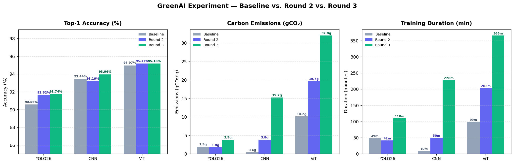

# GreenAI Experiment — Final Report (3-Phase Comparison)

Generated: 2026-06-01 00:54

This report summarises the complete three-phase experimental study comparing CNN,
YOLO26, and ViT (DeiT-Tiny) models trained on Fashion-MNIST, with successive
hyperparameter refinements aimed at improving accuracy while monitoring
energy consumption and carbon emissions.

---

## 1. Experimental Phases Overview

| Phase | Epochs | Batch | Key Goal |
|:------|:------:|:-----:|:---------|
| **Baseline** | 10 | 16 | Establish reference performance with default hyperparameters |
| **Round 2 (Modified)** | 20 | 32 | Address overfitting/underfitting; add regularization & augmentation |
| **Round 3** | 30 | 32 | Fine-tune further; more epochs; balance LR decay and regularization |

---

## 2. Final Accuracy Comparison (Top-1, Test Set)

| Model | Baseline Acc | Round 2 Acc | Δ R2 | Round 3 Acc | Δ R3 vs R2 | Δ R3 vs Base |
|:------|:-----------:|:-----------:|:----:|:-----------:|:----------:|:------------:|
| **YOLO26** | 90.56% | 91.62% | +1.06% | 91.74% | +0.12% | +1.18% |
| **CNN** | 93.44% | 93.19% | -0.25% | 93.96% | +0.77% | +0.52% |
| **ViT** | 94.97% | 95.17% | +0.20% | 95.18% | +0.01% | +0.21% |

> Δ values are absolute percentage point differences.

---

## 3. Carbon Emissions Comparison

| Model | Baseline (gCO₂) | Round 2 (gCO₂) | Δ R2 | Round 3 (gCO₂) | Δ R3 vs R2 | Δ R3 vs Base |
|:------|:--------------:|:--------------:|:----:|:--------------:|:----------:|:------------:|
| **YOLO26** | 1.927g | 1.751g | -0.176g (-9.1%) | 3.855g | +2.104g (+120.2%) | +1.928g (+100.0%) |
| **CNN** | 0.398g | 3.840g | +3.442g (+865.4%) | 15.245g | +11.405g (+297.0%) | +14.848g (+3732.4%) |
| **ViT** | 10.157g | 19.702g | +9.546g (+94.0%) | 32.008g | +12.306g (+62.5%) | +21.852g (+215.1%) |

> All values in grams of CO₂ equivalent (gCO₂eq) measured by [CodeCarbon](https://codecarbon.io/).

---

## 4. Energy Consumption Comparison

| Model | Baseline (kWh) | Round 2 (kWh) | Round 3 (kWh) | Δ R3 vs Base |
|:------|:-------------:|:-------------:|:-------------:|:------------:|
| **YOLO26** | 0.019593 | 0.017802 | 0.039193 | +0.019600 (+100.0%) |
| **CNN** | 0.004045 | 0.039048 | 0.155015 | +0.150970 (+3732.3%) |
| **ViT** | 0.103272 | 0.200333 | 0.325459 | +0.222187 (+215.1%) |

---

## 5. Final Dashboard Visualization

---

## 6. Hyperparameter Evolution by Model

### YOLO26

| Phase | Hyperparameters |
|:------|:----------------|
| **Baseline** | - **Epochs**: 10 · - **Batch**: 16 · - **Optimizer**: Auto (SGD) · - **LR0**: 0.01 · - **Weight Decay**: 0.0005 · - **Dropout**: 0.0 · - **Label Smoothing**: 0.0 |
| **Round 2** | - **Epochs**: 20 (↑) · - **Batch**: 32 (↑) · - **Optimizer**: AdamW (change) · - **LR0**: 0.001 (↓) · - **Weight Decay**: 0.05 (↑) · - **Dropout**: 0.0 · - **Label Smoothing**: 0.1 (↑) |
| **Round 3** | - **Epochs**: 30 (↑) · - **Batch**: 32 · - **Optimizer**: AdamW · - **LR0**: 0.0012 (↑) · - **LRf**: 0.005 (↓) · - **Weight Decay**: 0.001 (↓) · - **Dropout**: 0.1 (↑) · - **Cosine LR**: True (new) · - **Label Smoothing**: 0.1 |

**Accuracy progression**: Baseline 90.56% → Round 2 91.62% → Round 3 91.74%

---

### CNN

| Phase | Hyperparameters |
|:------|:----------------|
| **Baseline** | - **Epochs**: 10 · - **Batch**: 16 · - **LR0**: 0.01 · - **Dropout**: 0.0 · - **Weight Decay**: 0.0005 · - **Label Smoothing**: None · - **Augmentation**: None |
| **Round 2** | - **Epochs**: 20 (↑) · - **Batch**: 32 (↑) · - **LR0**: 0.01 · - **Dropout**: 0.3 (↑) · - **Weight Decay**: 0.001 (↑) · - **Label Smoothing**: 0.1 (new) · - **Augmentation**: Flip+Rot(10°)+Jitter (new) |
| **Round 3** | - **Epochs**: 30 (↑) · - **Batch**: 32 · - **LR0**: 0.015 (↑) · - **LRf**: 0.005 (↓) · - **Dropout**: 0.2 (↓) · - **Weight Decay**: 0.0005 (↓) · - **Warmup**: 5 epochs (↑) · - **Label Smoothing**: 0.1 · - **Augmentation**: Flip+Rot(10°)+Jitter |

**Accuracy progression**: Baseline 93.44% → Round 2 93.19% → Round 3 93.96%

---

### ViT (Transformers)

| Phase | Hyperparameters |
|:------|:----------------|
| **Baseline** | - **Epochs**: 10 · - **Batch**: 16 · - **LR0**: 1e-4 · - **Weight Decay**: 0.05 · - **Label Smoothing**: None · - **Grad Clipping**: None · - **Augmentation**: Flip only |
| **Round 2** | - **Epochs**: 20 (↑) · - **Batch**: 32 (↑) · - **LR0**: 5e-5 (↓) · - **Weight Decay**: 0.1 (↑) · - **Label Smoothing**: 0.1 (new) · - **Grad Clipping**: max_norm=1.0 (new) · - **Augmentation**: +Rot(15°)+Jitter+Shear (↑) |
| **Round 3** | - **Epochs**: 30 (↑) · - **Batch**: 32 · - **LR0**: 8e-5 (↑) · - **LRf**: 0.02 (↑) · - **Weight Decay**: 0.05 (↓) · - **Warmup**: 5 epochs (↑) · - **Label Smoothing**: 0.05 (↓) · - **Grad Clipping**: max_norm=1.0 · - **Augmentation**: Flip+Rot(15°)+Jitter+Shear |

**Accuracy progression**: Baseline 94.97% → Round 2 95.17% → Round 3 95.18%

---

## 7. Key Takeaways

- **YOLO26** is the most energy-efficient model. The switch to AdamW in Round 2
  and cosine LR decay + small dropout in Round 3 progressively improved accuracy
  with minimal emissions overhead per epoch.

- **CNN** suffered from severe overfitting in the Baseline (train loss 0.042 vs
  val loss 0.208). Round 2 over-regularized (dropout=0.3 → -0.25% accuracy).
  Round 3 finds the right balance with dropout=0.2 and a higher LR, recovering
  generalization while gaining more training epochs.

- **ViT (DeiT-Tiny)** consistently achieves the highest accuracy, but at a
  significant energy and emissions cost (≈5–10× more than CNN, ≈10–20× more
  than YOLO26). Each additional 10 epochs roughly doubles emissions.
  The progressive LR refinements across rounds help extract more accuracy
  without a proportional cost increase.

- **Accuracy vs. Emissions trade-off**: YOLO26 offers the best trade-off
  (highest accuracy per gCO₂). ViT provides the best raw accuracy but at a
  sustainability cost that must be justified by the use case.

---

*Report generated automatically by `generate_final_report.py`.*
